# TP Grupal: El Estanciero

## Introduccion

 - El estanciero es una adaptacion argentina del clasico juego de mesa Monopoly. El objetivo del juego es acumular la mayor cantidad de dinero y propiedades posibles, mientras se intenta evitar la bancarrota. Los jugadores recorren un tablero que representa un mapa ficticio de Argentina, en el que pueden comprar diferentes tipos de propiedades, como estancias, campos, estaciones de tren, etc. Además, se enfrentan a diferentes eventos y situaciones que pueden afectar su economía, como impuestos, mejoras en las propiedades, alquileres, entre otros. Los jugadores compiten entre sí para adquirir propiedades estratégicas y construir sobre ellas para aumentar su valor y generar ingresos. El juego se desarrolla a lo largo de varias rondas, y el jugador que logre acumular la mayor cantidad de riqueza al final del juego es declarado el ganador.

## Experiencia de usuario
 - El software presentado emula una version digital del juego de "El Estanciero" donde se competira contra otros jugadores virtuales, las acciones disponibles seran mostradas en un menú por consola donde se ingresara lo que desee hacer el jugador, el desafío que afronta nuestro software es brindar una experiencia divertida sin necesidad de tener los materiales fisicos del juego y permitir a todo aquel que tenga un ordenador pasar horas de juego con una interfaz sencilla como es la consola donde será guiado para todo el tiempo saber que opciones tiene para sacar maximo provecho de su turno y de ser necesario guardar la partida para continuar más tarde enfrentandosé a los jugadores virtuales creados e incluidos en nuestros software.

## Inicio del juego
 - Al iniciar se le preguntara al usuario si desea empezar una nueva partida o si quiere cargar una partida ya empezada (En caso de que exista alguna).

 - Si se quiere cargar una partida ya empezada, el programa traera desde la base de datos el estado de un tablero junto con los jugadores y sus atributos (dinero, posicion, propiedades, cartas, etc) y resumira la partida desde donde se dejo.

   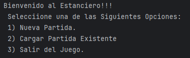

 - Si se quiere empezar una nueva partida, se consultara el nivel dificultad entre "Facil", "Normal" o "Dificil", donde:
    - 1.El modo **Difícil** incluye 4 jugadores virtuales extra cada uno con un perfil de juego diferente (1 agresivo, 2 moderados y 1 conservador).
    - 2.El modo **Normal** incluye 3 jugadores virtuales extra, cada uno con un perfil de juego diferente (1 agresivo, 1 moderado y 1 conservador).
    - 3.El modo **Fácil** incluye 2 jugadores virtuales extra, cada uno con un perfil de juego diferente (1 moderado y 1 conservador).

      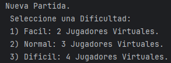

 - Al inicio del juego el jugador puede elegir opcionalmente si se permite ganar el juego por cantidad de valores totales; si opta por esto, debe ingresar cual es el monto al que debe arribar un jugador para ganar la partida.

     ● Cada jugador inicia con 35.000 en billetes.

     ● Todos los jugadores inician desde la salida.

    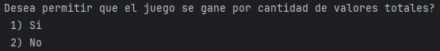
   
 - Asignar un orden de turno a los jugadores definida por el lanzamiento de los dados (se tiran los dados y quien saque el número más alto iniciará el mismo e irán jugando en orden descendente por el valor de los dados). Si se repitiera el número, se asignará el turno de manera aleatoria a alguno de ellos.

   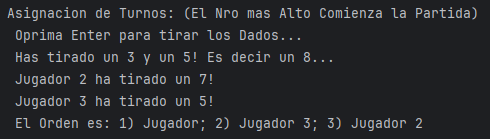

## Movimiento en el tablero:

  - Los jugadores deben poder lanzar los dados y moverse por el tablero según el resultado del lanzamiento. (Esto último debe suceder automáticamente)

  - Si un jugador cae en una casilla de propiedad no adquirida, debe tener la opción de comprarla.

    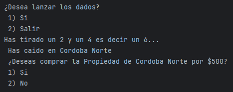

 - Si un jugador cae en una casilla de propiedad adquirida por otro jugador, debe pagar el alquiler correspondiente.

 - El pago de los alquileres será automático cuando un jugador caiga en una
 propiedad de otro jugador.

   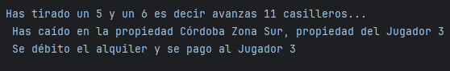

 - Si en los dados salen números iguales, (dos 1 o dos 4, etc.) una vez hecho el movimiento de adelantar y efectuadas las transacciones que indique la casilla a la que ha llegado, vuelve a tirar los dados, pudiendo esto repetirse dos veces, pero si sucediera una tercera tiene que ir preso a la comisaria.

   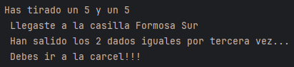

## Compra y venta de propiedades:

 - Los jugadores deben poder comprar propiedades cuando caigan en casillas de propiedad no adquiridas por otros jugadores.

 - Los jugadores deben poder vender propiedades en su poder al banco.

## Construcción de mejoras:

 - Los jugadores deben poder construir mejoras (Campos, Chacras y Estancias) en las propiedades que poseen, siempre y cuando cumplan con los requisitos necesarios.

   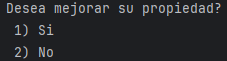

  - La venta de Chacras y Estancias es exclusiva entre el Propietario y el Banco.

## Eventos y situaciones especiales:

 - Los jugadores deben poder enfrentarse a eventos y situaciones especiales, como impuestos, premios, tarjetas de suerte, entre otros, que pueden afectar su economía.
 Cuando un jugador llega a una casilla con la denominación Suerte o Destino tiene que levantar la tarjeta correspondiente y luego de cumplir lo que indica de manera automática.
 Los Premios e Impuestos son cobrados o pagados por el Banco de manera automática.
 Un jugador preso tiene que permanecer en la casilla comisaría. Si cae en la casilla no se le considera preso.

   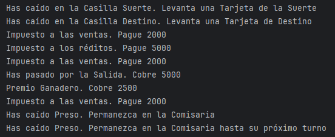

 - Al llegar a la casilla de descanso, el jugador tiene derecho, si así lo desea, a quedarse por dos turnos, siempre que no saque doble en los dados. Es condición avisar antes de tirar los dados los deseos de quedarse.

   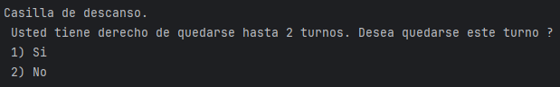

## Gestión financiera:

 - Los jugadores deben poder gestionar su dinero decidiendo sobre la compra de propiedades y construcción de mejoras. El pago de alquileres, impuestos y premios será ejecutado automáticamente por el sistema.

## Finalización del juego:
 - El juego debe finalizar cuando un jugador acumule una cantidad determinada de dinero o cuando todos los demás jugadores hayan quedado en bancarrota.

 - Se debe mostrar un mensaje indicando al jugador ganador al finalizar la partida.

   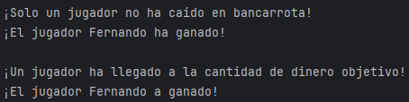